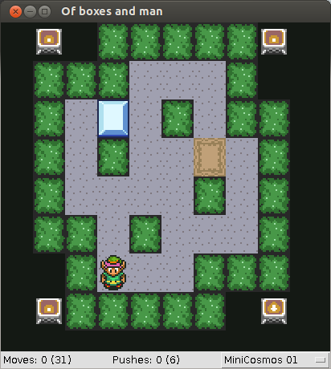

A Zelda-Sokoban mashup made around May 2009.

# Original README

Welcome to the warehouse.
We have boxes that needs pushing and you're a pusher. See where I'm going ?
Arrow keys move you around, return resets the level and space skips it.
Now go move these crates where they belong, and don't slack off like the last guy.

# Credits

Original Sokoban by Hiroyuki Imabayashi.

MiniCosmos levels done by Aymeric du Peloux (http://membres.lycos.fr/nabokos)

Sprites ripped by Helios and Bruce Juice.
From http://www.spriters-resource.com

Wil for the feedback ;)
